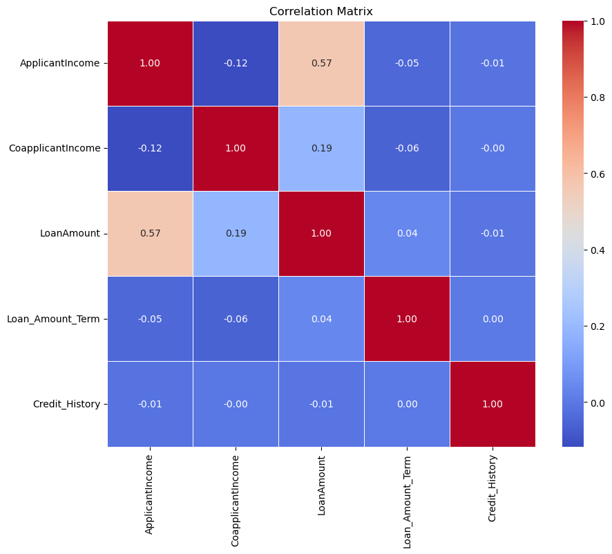
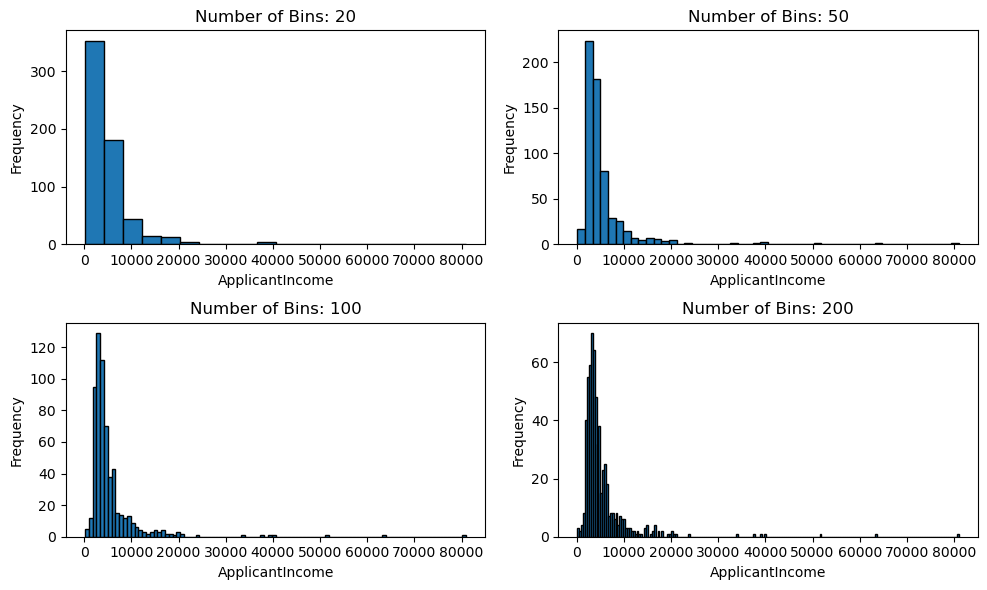
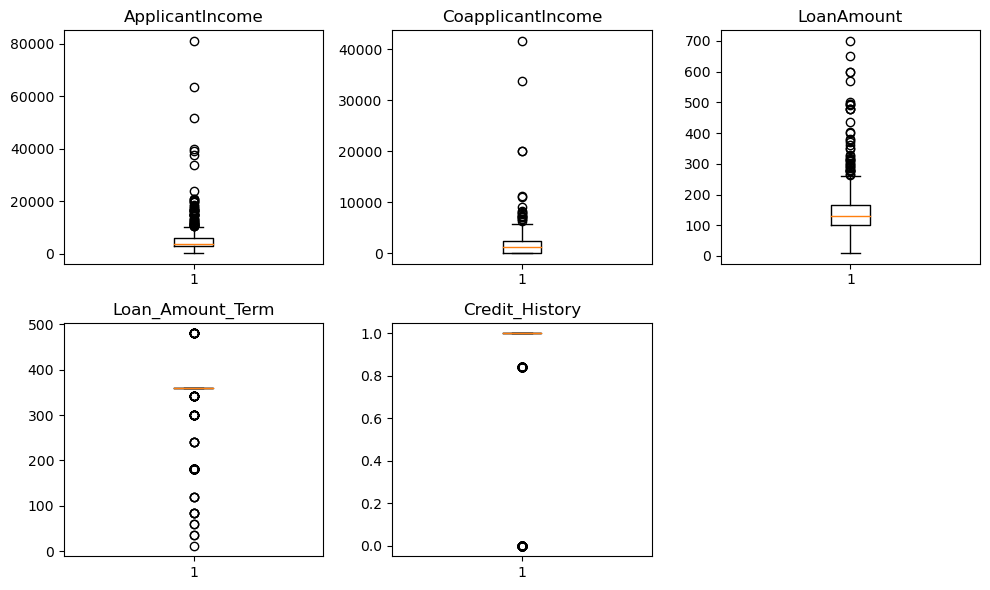
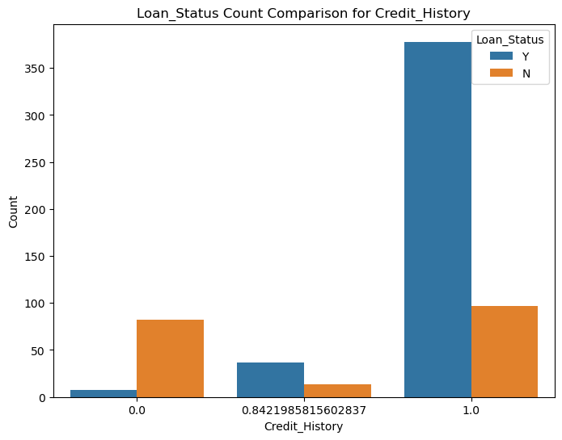
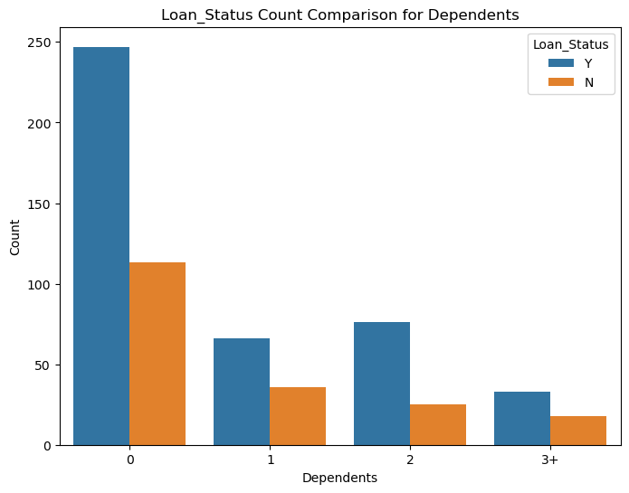
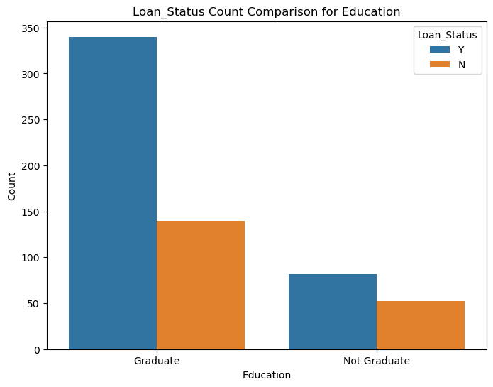
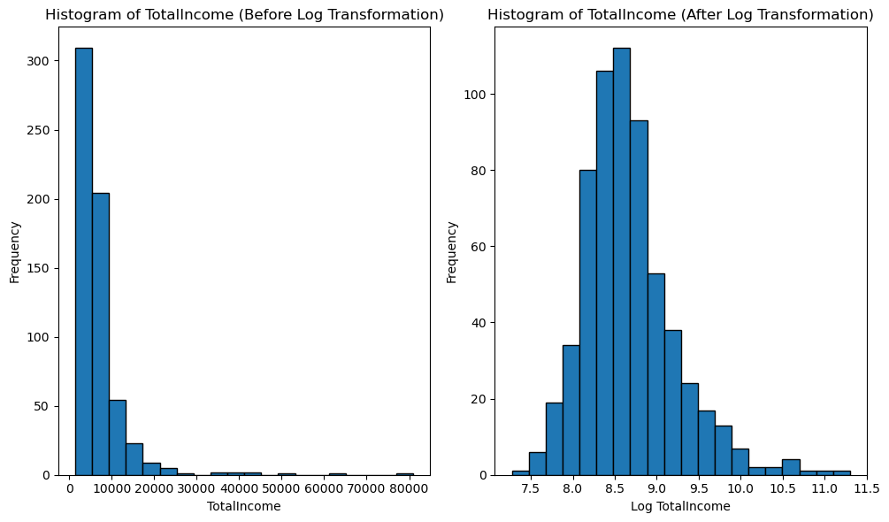
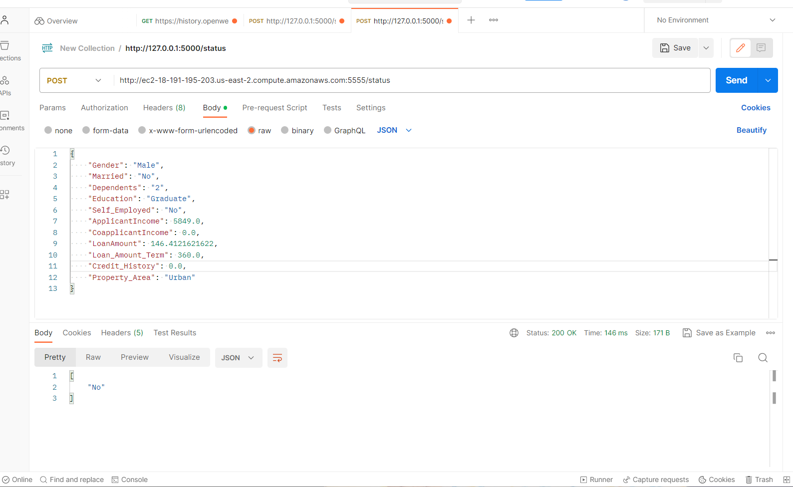

# Mini-project IV

### [Assignment](assignment.md)

## Project/Goals
Generate meaningful hypotheses about loan approval factors based on available variables.
Explore the data to identify patterns and insights that can inform decision-making.
Clean the data by addressing missing values and outliers for accurate analysis.
Build a predictive model to determine the likelihood of loan approval.
Implement a pipeline to streamline data preparation, feature engineering, and modeling processes.
Deploy the model to a cloud platform and test its functionality for real-world loan prediction scenarios.

## Hypothesis
Applicants with higher credit history, lower loan amount, and higher income will be more likely to have their loan approved.

To test this hypothesis, we can perform the following analysis:
Analyze Credit History: We can examine the distribution of credit history values among approved and rejected loan applications. If a higher proportion of approved applications have a credit history value of 1.0 (indicating good credit history), it would support our hypothesis.
Loan Amount Analysis: We can compare the loan amount requested by approved and rejected applicants. If the average loan amount for approved applications is lower than for rejected applications, it would suggest that lower loan amounts increase the chances of loan approval.
Income Analysis: We can analyze the income levels of approved and rejected applicants. If the average income of approved applicants is higher than for rejected applicants, it would indicate that higher income plays a role in loan approval.
Combination of Factors: We can further investigate the combined effect of credit history, loan amount, and income on loan approval. We can group applicants based on different combinations of these factors (e.g., high credit history + low loan amount + high income) and compare the approval rates within each group. If certain combinations consistently have higher approval rates, it would strengthen our hypothesis.

## EDA 
1.Correlation Matrix.

2.Study distribution of various variables. Plot the histogram of ApplicantIncome, try different number of bins.

3.Look at box plots to understand the distributions.

4.Try to understand categorical variables in more details using pandas.DataFrame.pivot_table and some visualizations.

5.Try a log transformation to get rid of the extreme values in LoanAmount. Plot the histogram before and after the transformation

  

## Process
EDA Process:

Initial Data Inspection:

Examined the loan dataset structure and identified the variables.
Checked the data types of each variable and looked for any missing values or inconsistencies.
Univariate Analysis:

Analyzed each variable individually.
Calculated frequency counts and percentages for categorical variables.
Created histograms and calculated descriptive statistics for numerical variables.
Bivariate Analysis:

Explored relationships between variables.
Created contingency tables and visualized associations between categorical variables and loan status.
Used scatter plots and box plots to identify trends or correlations between numerical variables and loan status.
Missing Data Imputation:

Identified variables with missing values.
Imputed missing categorical values with the mode and created a separate category.
Imputed missing numerical values with mean or median values.
Outlier Treatment:

Converted categorical variables into dummy variables for modeling.

Modeling Process:

Built a Predictive Model:
Selected an appropriate algorithm ( random forest) for loan prediction.
Split the dataset into training and testing sets.
Trained the model on the training set and evaluated its performance.

eployment Process:

Developed a Pipeline:

Created a data preparation and modeling pipeline to streamline the process.
Integrated data cleaning, feature engineering, and modeling steps into a cohesive workflow.
Deployed the Model:

Deployed the model on a local platform for accessibility.

Testing Process:

Conducted Testing:
Used tools like Postman and  Python to test the deployed model.
Input test data and evaluated the model's predictions.
Ensured the model performed accurately and provided reliable loan approval predictions.

## Results/Demo
1.Best Parameters: {'feature_selection__kbest__k': 3, 'feature_selection__pca__n_components': 2, 'model__max_depth': 5, 'model__n_estimators': 100}
Best Score: 0.8145949288806431

2.Accuracy of model is  0.7723577235772358.

3.url to local machine for model is http://127.0.0.1:5000/status.

4  .

## Challanges 
Deployment Constraint: Unfortunately, there was an issue while deploying the model on the cloud due to space limitations. This prevented us from making the model accessible for real-world loan prediction scenarios.

Time Constraints: Given the limited timeframe for the project, there was a need to work efficiently and quickly. This posed a challenge in terms of allocating sufficient time to each stage of the process.

## Future Goals
Cloud Deployment: Moving forward, it is a priority to resolve the space error and successfully deploy the model on a cloud platform. This will enable seamless accessibility and utilization of the model for loan approval predictions.

Enhanced EDA and Feature Engineering: To further improve the project, dedicating more time and effort to the exploratory data analysis (EDA) phase will provide deeper insights into the dataset. Additionally, investing in more comprehensive feature engineering techniques will help derive more meaningful and predictive variables.